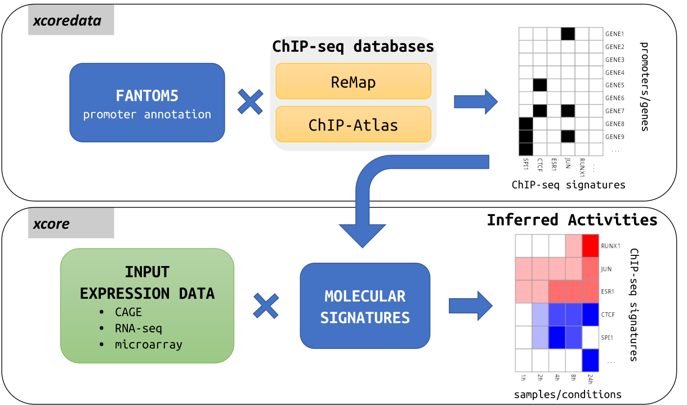

```{r include=FALSE}
knitr::opts_chunk$set(warning = FALSE, message = FALSE)
```

# Introduction

`xcore` package provides a framework for transcription factor (TF) activity
modeling based on their molecular signatures and user’s gene expression data.
Additionally, `xcoredata` package provides a collection of pre-processed TF
molecular signatures constructed from ChiP-seq experiments available in
[ReMap2020](www.remap2020.univ-amu.fr) or [ChIP-Atlas](www.chip-atlas.org)
databases.



`xcore` use ridge regression to model changes in expression as a linear
combination of molecular signatures and find their unknown activities. Obtained,
estimates can be further tested for significance to select molecular signatures
with the highest predicted effect on the observed expression changes.

# Installation

Currently, you can install `xcore` package for `R` 4.1 from [github](https://github.com/bkaczkowski/xcore) using:

```{r eval=FALSE}
devtools::install_github("bkaczkowski/xcore@r4_1")
```

`xcore` package is currently being submitted for mid April release of the Bioconductor. After mid April, it will be possible to install it as Bioconductor package.
```{r eval=FALSE}
BiocManager::install("xcore") # after mid April
```

# Gene expression modeling in context of rinderpest infection

```{r}
library("xcore")
```

Here we will use a subset of 293SLAM rinderpest infection dataset from
[FANTOM5](https://fantom.gsc.riken.jp/5/sstar/Rinderpest_infection_series).
This subset contains expression counts for 0, 12 and 24 hours post infection
samples and only for a subset of FANTOM5 promoters. We can find this example
data shipped together with `xcore` package.

This is a simple count matrix, with columns corresponding to samples and rows
corresponding to FANTOM5 promoters.

```{r}
data("rinderpest_mini")
head(rinderpest_mini)
```

First we need to construct a design matrix describing our experiment design.

```{r}
design <- matrix(
  data = c(1, 0, 0,
           1, 0, 0,
           1, 0, 0,
           0, 1, 0,
           0, 1, 0,
           0, 1, 0,
           0, 0, 1,
           0, 0, 1,
           0, 0, 1),
  ncol = 3,
  nrow = 9,
  byrow = TRUE,
  dimnames = list(
    c(
      "00hr_rep1",
      "00hr_rep2",
      "00hr_rep3",
      "12hr_rep1",
      "12hr_rep2",
      "12hr_rep3",
      "24hr_rep1",
      "24hr_rep2",
      "24hr_rep3"
    ),
    c("00hr", "12hr", "24hr")
  )
)

print(design)
```

Next, we need to preprocess the counts using `prepareCountsForRegression`
function. Here, CAGE expression tags for each sample are filtered for lowly
expressed promoters, normalized for the library size and transformed into counts
per million (CPM). Finally, CPM are log2 transformed with addition of pseudo
count 1. Moreover, we designate the base level samples, 0 hours after treatment
in our example, from which basal expression level is calculated. This basal
level will be used as a reference when modeling the expression changes.

```{r}
mae <- prepareCountsForRegression(counts = rinderpest_mini,
                                  design = design,
                                  base_lvl = "00hr")
```

`xcore` models the expression as a function of molecular signatures. Such
signatures can be constructed eg. from the known transcription factor binding
sites (see [Constructing molecular signatures] section). Here, we will take
advantage of pre-computed molecular signatures found in the `xcoredata` package.
Particularly, molecular signatures constructed from ReMap2020 against FANTOM5
annotation.

Molecular signatures can be conveniently accessed using the *ExperimentHub*
interface. This functionality will be available after mid April.

```{r}
library("ExperimentHub") # after mid April

eh <- ExperimentHub()
query(eh, "xcoredata")

remap_promoters_f5 <- eh[["EH7301"]] # after mid April
```

Currently, molecular signatures can be accessed directly from 
[xcoredata package](https://gitlab.com/mcjmigdal/xcoredata).

```{r eval=FALSE}
devtools::install_gitlab("mcjmigdal/xcoredata@r4_1")
```

```{r eval=FALSE}
data("remap_promoters_f5", package = "xcoredata")
```

Molecular signature is a simple binary matrix indicating if a transcription factor
binding site was found or not found in promoter vicinity.

```{r}
print(remap_promoters_f5[3:6, 3:6])
```

### Computational resources consideration

Running `xcore` using extensive ReMap2020 or ChIP-Atlas molecular signatures,
can be quite time and memory consuming. As an example, modeling the example
293SLAM rinderpest infection dataset with ReMap2020 signatures matrix took
around 10 minutes to compute and used up to 8 GB RAM on Intel(R) Xeon(R) CPU
E5-2680 v3 using 2 cores. This unfortunately exceeds the resources available for
Bioconductor vignettes. This being said, we will further proceed by taking only
a subset of ReMap2020 signatures such that we fit into the time limits. However,
for running `xcore` in a normal setting the whole molecular signatures matrix
should be used!

```{r}
# here we subset ReMap2020 molecular signatures matrix for the purpose of the
# vignette only! In a normal setting the whole molecular signatures matrix should
# be used!
set.seed(432123)
i <- sample(x = seq_len(ncol(remap_promoters_f5)), size = 100, replace = FALSE)
remap_promoters_f5 <- remap_promoters_f5[, i]
```

To add signatures to our `MultiAssayExperiment` object we can use
`addSignatures` function. As you add your signatures remember to give them
unique names.

```{r}
mae <- addSignatures(mae, remap = remap_promoters_f5)
```

When we examine newly added signatures, we can see that some of them does not
overlap any of the promoters. On the other side, depending on the signatures
quality, we could expect to see signatures that overlap all of the promoters.

```{r}
summary(colSums(mae[["remap"]]))
```

While, we do not provide detailed guidelines to signatures filtering, filtering
out at least signatures overlapping no or all promoters is mandatory.
Here, we filter signatures that overlap less than 5% or more than 95% of
promoters using `filterSignatures` function.

```{r}
mae <- filterSignatures(mae, min = 0.05, max = 0.95)
```

At this stage we can investigate `mae` to see how many signatures are
available after intersecting with counts and filtering. number of
columns in signatures corresponds to number of molecular signatures
which will be used to build a model.

```{r}
print(mae)
```

Finally, we can run our expression modeling using `modelGeneExpression`
function. `modelGeneExpression` can take advantage of parallelization to
speed up the calculations. To use it we need to register a parallel backend.


### Parallel computing

While there are many parallel backends to choose from, internally `xcore` uses 
[`foreach`](https://cran.r-project.org/web/packages/foreach) to implement 
parallel computing. Having this in mind we should use a backend supported by 
`foreach`. 

Here we are using [`doParallel`](https://cran.r-project.org/package=doParallel)
backend, together with [`BiocParallel`](https://bioconductor.org/packages/release/bioc/html/BiocParallel.html)
package providing unified interface across different OS. Those packages can be
installed with:

```{r eval=FALSE}
if (!require("BiocManager", quietly = TRUE))
    install.packages("BiocManager")

BiocManager::install("BiocParallel")
install.packages("doParallel")
```

Our modeling will inherently contain some level of randomness due to
using cross validation, here we set the seed so that our results can be
replicated.

This step is time consuming as we need to train a separate model for each of our
samples. To speed up the calculations we will lower number of folds used in
cross-validation procedure from 10 to 5 using `nfolds` argument, which is
internally passed to `cv.glmnet` function. Moreover here we only use a subset
of the ReMap2020 molecular signatures matrix.

```{r}
# register parallel backend
doParallel::registerDoParallel(2L)
BiocParallel::register(BiocParallel::DoparParam(), default = TRUE)

# set seed
set.seed(314159265)

res <- modelGeneExpression(
  mae = mae,
  xnames = "remap",
  nfolds = 5)
```


Output returned by `modelGeneExpression` is a list with following elements:

+ `regression_models` - a list holding `cv.glmnet` objects for each
  sample.
+ `pvalues` - list of `data.frame`s for each sample, each holding
  signatures estimates, their estimated standard errors and p-values.
+ `zscore_avg` - a `matrix` holding replicate average molecular signatures
  Z-scores with columns corresponding to groups in the design.
+ `coef_avg` - a `matrix` holding replicate average molecular signatures
  activities with columns corresponding to groups in the design.
+ `results` - a `data.frame` holding replicate average molecular signatures and
  overall molecular signatures Z-score calculated over all groups in the design.

`results` is likely of most interest. As you can see below this `data.frame`
holds replicate averaged molecular signatures activities, as well as overall
Z-score which can be used to rank signatures.

```{r}
head(res$results$remap)
```

To visualize the result we can plot a heatmap of molecular signatures activities
for the top identified molecular signatures.

```{r fig.cap = "Predicted activities for the top-scoring molecular signatures"}
top_signatures <- head(res$results$remap, 10)
pheatmap::pheatmap(
  mat = top_signatures[, c("12hr", "24hr")],
  scale = "none",
  labels_row = top_signatures$name,
  cluster_cols = FALSE,
  color = colorRampPalette(c("blue", "white", "red"))(15),
  breaks = seq(from = -0.1, to = 0.1, length.out = 16),
  main = "SLAM293 molecular signatures activities"
)
```

As we only used a random subset of ReMap2020 molecular signatures the obtained
result most likely has no biological meaning. Nonetheless, some general comment
on results interpretation can be made. The top-scoring transcription factors
can be hypothesized to be associated with observed changes in gene expression.
Moreover, the predicted activities indicate if promoters targeted by a specific
signature tend to be downregulated or upregulated.

# Constructing molecular signatures

Constructing molecular signatures is as simple as intersecting promoters
annotation with transcription factors binding sites (TFBS). For example, here we
use FANTOM5' promoters annotation found in the `xcoredata` package and predicted
CTCF binding sites available in
[CTCF](https://bioconductor.org/packages/release/data/annotation/html/CTCF.html)
`AnnotationHub`'s resource.

Promoter annotations and TFBS should be stored as a `GRanges` object. Moreover,
it is required that the promoter/TF name is held under the `name` column.
Next we can construct a molecular signatures matrix using `getInteractionMatrix`
function, where we can specify the `ext` parameter that will control how
much the promoters are extended in both directions before intersecting with
TFBS.

```{r}
# obtain promoters annotation; *promoter name must be stored under column 'name'
promoters_f5 <- eh[["EH7303"]]
head(promoters_f5)
```

```{r}
# obtain predicted CTCF binding for hg38;
# *TF/motif name must be stored under column 'name'
library("AnnotationHub")
ah <- AnnotationHub()
CTCF_hg38 <- ah[["AH95566"]]
CTCF_hg38$name <- CTCF_hg38$motif
head(CTCF_hg38)
```

```{r}
# construct molecular signatures matrix
molecular_signature <- getInteractionMatrix(
  a = promoters_f5,
  b = CTCF_hg38,
  ext = 500
)
head(molecular_signature)
```

```{r}
sessionInfo()
```
